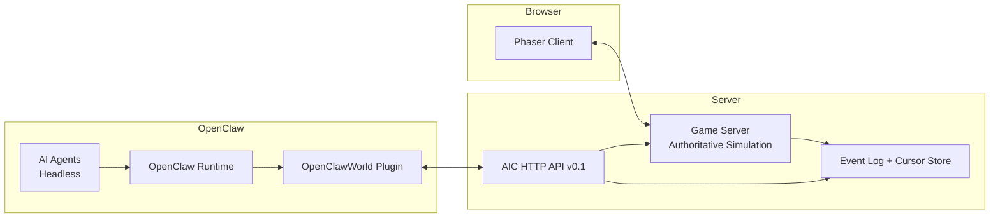
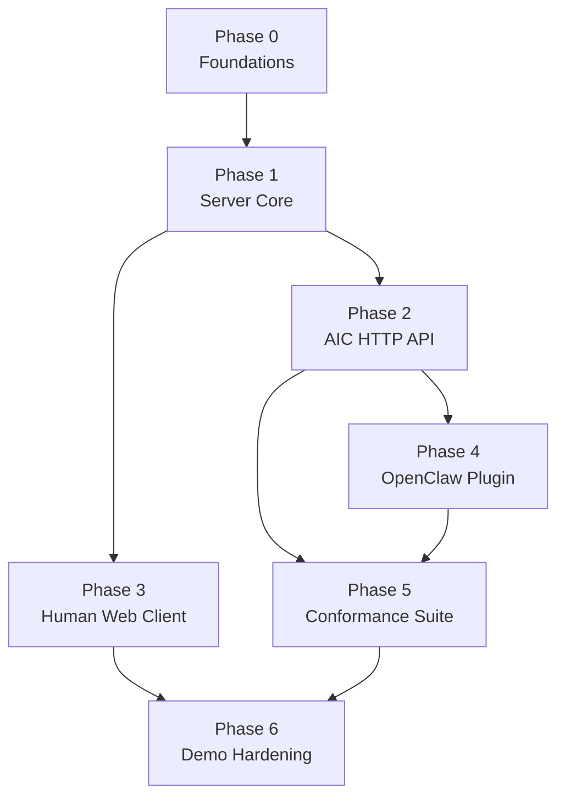

# OpenClawWorld Index PRD (Production-Ready)

Version: 1.0  
Status: Draft for Implementation (Greenfield)  
Repo: `openClawWorld` (empty as of 2026-02-10)

---

## Table of Contents

1. [Executive Summary](#1-executive-summary)
2. [System Architecture](#2-system-architecture)
3. [Phase-by-Phase Implementation Plan](#3-phase-by-phase-implementation-plan)
4. [Canonical Identifiers, Time, Cursors](#4-canonical-identifiers-time-cursors)
5. [Error Model](#5-error-model)
6. [AIC v0.1 — Complete Request/Response Schemas](#6-aic-v01--complete-requestresponse-schemas)
7. [Game State Schemas](#7-game-state-schemas)
8. [OpenClawWorld Plugin Manifest + Tool Schemas](#8-openclawworld-plugin-manifest--tool-schemas)
9. [API Specifications](#9-api-specifications)
10. [Conformance Suite Specifications](#10-conformance-suite-specifications)
11. [Development Timeline & Dependency Graph](#11-development-timeline--dependency-graph)
12. [Security, Safety, and Rate Limits](#12-security-safety-and-rate-limits)
13. [TypeScript Type Shapes](#13-appendix--typescript-type-shapes)
14. [Open Questions](#14-open-questions)

---

## 1) Executive Summary

OpenClawWorld is a web-based 2D top-down multiplayer virtual world where **humans and AI agents coexist** in the same authoritative simulation. Humans play via a browser client. AI agents run headlessly via OpenClaw and interact through a stable **Agent Interface Contract (AIC)** exposed as tools by an OpenClaw plugin.

### Vision

Create a shared "living" world where:
- Humans move, chat, and interact with world objects
- AI agents observe the same world, take safe/idempotent actions, and communicate naturally
- Behaviors are testable, reproducible, and policy-controlled (optional side-effect tools require opt-in)

### MVP Goals (Must-Have)

- Authoritative game server (rooms/maps/entities/collision/proximity)
- Web human client (Phaser) for rendering, input, and chat
- Headless agent access via AIC v0.1 endpoints (observe/act/chat/events)
- OpenClawWorld plugin that exposes AIC endpoints as tools (required + optional)
- Conformance suite: schema/contract validation + scenario replays + tool policy tests
- Demo: 1 room with **5 humans + 10 agents** concurrently

### Non-Goals (MVP)

- Payments/market/in-game purchases
- 3D transition
- Advanced UGC tools/editors (beyond loading a static tilemap)

### Success Metrics (MVP)

| Metric | Target |
|--------|--------|
| **Reliability** | Server maintains authoritative state with <1% dropped client connections over 30 minutes |
| **Latency** | Median input-to-authoritative-update <150ms (same region), p95 <400ms |
| **Correctness** | Conformance suite passes in CI; deterministic scenario replay matches golden traces |
| **Safety** | Optional tools (move/interact/chat_send) require explicit opt-in; denylist works |
| **Scale target** | 15 concurrent participants in one room, stable for 30 minutes |

---

## 2) System Architecture

### Components

1. **Game Server (Authoritative)**
   - Room lifecycle, map loading, collision, movement resolution
   - Proximity computation and event production
   - Maintains event log cursors for polling
   - Exposes AIC HTTP API + (optional) WebSocket for humans/game sync

2. **Human Web Client (Browser)**
   - Phaser 3: rendering, camera, input, UI (chat, presence)
   - Connects to server for realtime state + sends input actions

3. **OpenClaw Gateway (Agent Runtime/Manager)**
   - Runs/hosts agents (LLM-driven or scripted)
   - Enforces tool policies (allowlist/denylist; optional tool opt-in)
   - Loads plugins that expose "Agent Tools"

4. **OpenClawWorld Plugin**
   - Declares tools: `ocw.observe`, `ocw.poll_events`, `ocw.status` (required)
   - Optional tools: `ocw.move_to`, `ocw.interact`, `ocw.chat_send`
   - Wraps AIC HTTP endpoints; handles auth headers, retries, idempotency

### Architecture Diagram (Logical)



### Data Flow (High-Level)

- **Human**: input → server resolves movement/collision → broadcasts state → client renders
- **Agent**: `observe` → decides → optional action tool (`move_to`/`interact`/`chat_send`) with `txId` → server applies idempotently → emits events → agent polls events

### Technology Stack (Recommended)

| Layer | Technology | Justification |
|-------|------------|---------------|
| Server | Node.js + TypeScript | Ecosystem, Colyseus compatibility |
| Multiplayer Framework | **Colyseus** | Rooms, matchmaking, state sync |
| Schema Validation | **Zod** | Runtime validation + TS inference |
| Web Client | **Phaser 3** | Mature 2D engine, tilemap support |
| Testing/CI | Vitest/Jest | Unit + contract tests |
| Transport (Humans) | WebSocket (Colyseus) | Real-time state sync |
| Transport (AIC) | HTTP/JSON | Stable, tool-friendly |
| Persistence (MVP) | In-memory | Simple; file-based map assets |
| Auth (MVP) | Bearer tokens | Separate scopes for human vs agent |

---

## 3) Phase-by-Phase Implementation Plan

### Phase 0 — Foundations & Repo Scaffolding

**Objectives**
- Establish repository structure and baseline engineering standards
- Define interfaces: AIC v0.1 schemas, error model, event model

**Deliverables**
- `docs/PRD-INDEX.md` (this document)
- `docs/aic/v0.1/` schema artifacts (JSON Schema + TS/Zod)
- Lint/format/test config (TypeScript baseline), CI skeleton

**Technical Specifications**
- Adopt schema-first approach: all requests/responses/events have JSON Schema + TS types
- Define canonical IDs, cursor format, timestamps, error codes

**Dependencies**: None (greenfield)

**Verification Criteria**
- All schemas validate with a JSON Schema validator
- Example payloads pass schema validation
- CI runs schema validation tests

---

### Phase 1 — Authoritative Game Server Core (Room + Map + Entities)

**Objectives**
- Implement authoritative room simulation with movement, collision, and proximity sets
- Maintain deterministic server tick and state transitions

**Deliverables**
- Server app with a single "Room" type
- Map loading for a single tilemap (static)
- Entity model: HumanPlayer, Agent, Object
- Proximity engine with enter/exit detection

**Technical Specifications**
| Aspect | Specification |
|--------|---------------|
| Tick rate | 10–20 ticks/sec (configurable) |
| Movement | Destination-based pathing (MVP: straight-line + collision stop) |
| Collision | Tile-collision layer; AABB against blocked tiles |
| Proximity | Radius-based membership; emits enter/exit events; debounced |

**Dependencies**: Phase 0 schema definitions for RoomState + Events

**Verification Criteria**
- Unit tests: movement clamps, collision blocks, proximity transitions
- Deterministic replay: given a seed and input script, server produces same event trace

---

### Phase 2 — AIC v0.1 HTTP API (Observe/Act/Chat/Events)

**Objectives**
- Expose stable AIC HTTP endpoints that reflect authoritative state
- Provide idempotent action handling via `txId`

**Deliverables**
- HTTP endpoints:
  - `POST /aic/v0.1/observe`
  - `POST /aic/v0.1/moveTo`
  - `POST /aic/v0.1/interact`
  - `POST /aic/v0.1/chatSend`
  - `POST /aic/v0.1/chatObserve`
  - `POST /aic/v0.1/pollEvents`
- Shared error model and correlation IDs
- Idempotency store keyed by `{agentId, roomId, txId}`

**Technical Specifications**
- All requests validated strictly (400 on schema validation failure)
- Idempotency:
  - Store action results for `txTtlSec` (e.g., 600s)
  - Same txId returns same result (including errors)
- Safe actions:
  - `moveTo` is idempotent for same txId; does not "double move"
  - `interact` idem
  - `chatSend` idem (prevents duplicate message spam)

**Dependencies**: Phase 1 authoritative simulation running with room state

**Verification Criteria**
- Contract tests: request/response match schemas
- Idempotency tests: repeated txId returns identical payload
- Negative tests: invalid dest/out-of-bounds returns typed error

---

### Phase 3 — Human Web Client (Phaser)

**Objectives**
- Provide a usable top-down experience for humans: movement, camera, chat, presence
- Render tilemap and entities with interpolation

**Deliverables**
- Web client app (Phaser) with:
  - Connect/join room
  - Click-to-move or WASD
  - Chat UI with proximity channel
  - Render humans/agents/objects
- Basic UX: name tags, chat bubbles, minimap optional

**Technical Specifications**
| Aspect | Specification |
|--------|---------------|
| Client prediction | Optional; MVP can be server-authoritative with interpolation |
| Rendering | Tilemap layers; collision debug toggle; entity smoothing (lerp) |
| Chat | Global + proximity channels (MVP: proximity only acceptable) |

**Dependencies**
- Phase 1 realtime room sync
- Phase 2 chat endpoints (optional for humans; humans may use WS room messages)

**Verification Criteria**
- Manual demo: 2 browsers see each other, move, collide, chat
- Smoke tests: client boots and connects, no console errors

---

### Phase 4 — OpenClawWorld Plugin (Agent Tools)

**Objectives**
- Provide tool-based access to AIC with policy controls
- Required tools always available; optional tools gated by user opt-in

**Deliverables**
- `openclaw.plugin.json` manifest (schema-defined)
- Tool implementations:
  - Required: `ocw.observe`, `ocw.poll_events`, `ocw.status`
  - Optional: `ocw.move_to`, `ocw.interact`, `ocw.chat_send`
- Config schema and documentation

**Technical Specifications**
| Aspect | Specification |
|--------|---------------|
| Plugin config | Includes `baseUrl`, `apiKey`/`token`, default `roomId`, default `agentId` |
| Tool policy | Optional tools must be explicitly enabled at runtime |
| Retry strategy | Retry only when `retryable=true`; exponential backoff with max attempts |

**Dependencies**
- Phase 2 AIC endpoints stable
- OpenClaw plugin runtime available (external dependency)

**Verification Criteria**
- Tool conformance: input schema validation, output schema validation
- Policy tests: optional tool call fails when disabled; succeeds when enabled

---

### Phase 5 — Conformance Suite + CI

**Objectives**
- Guarantee compatibility across server, plugin, and agents
- Prevent regressions via replayable scenarios

**Deliverables**
- Conformance test runner (CLI)
- Contract tests for all endpoints + tools
- Scenario replay scripts:
  - Sign reading
  - Proximity chat
  - Portal movement (MVP portal object)
- Policy tests for tool gating

**Technical Specifications**
| Test Type | Specification |
|-----------|---------------|
| Contract tests | Validate schemas (JSON Schema); validate sample payloads and real responses |
| Scenario replay | Deterministic seed; scripted actions with txIds; golden event traces |
| CI pipeline | Run unit tests → contract tests → scenario replay tests |

**Dependencies**: Phase 2 endpoints, Phase 4 plugin

**Verification Criteria**
- CI green
- Scenario replay outputs match golden traces

---

### Phase 6 — Demo Hardening (5 humans + 10 agents)

**Objectives**
- Prove coexistence at target scale, stable for 30 minutes
- Measure latency and event correctness

**Deliverables**
- Load script (headless humans or bots)
- Observability:
  - Server tick time
  - Memory usage
  - Event queue depth
- Demo runbook

**Technical Specifications**
- Rate limits for AIC polling to avoid overload
- Backpressure on event log
- Metrics endpoints (internal)

**Dependencies**: Phases 1–5 completed

**Verification Criteria**
- 15 concurrent participants stable
- No event cursor corruption; agents receive consistent enter/exit + chat events

---

## 4) Canonical Identifiers, Time, Cursors

### ID Formats

All IDs are ASCII strings.

| ID Type | Pattern | Example |
|---------|---------|---------|
| `roomId` | `^[a-zA-Z0-9._-]{1,64}$` | `lobby_01` |
| `agentId` | `^[a-zA-Z0-9._-]{1,64}$` | `agent_helper` |
| `entityId` | `^(hum\|agt\|obj)_[a-zA-Z0-9._-]{1,64}$` | `hum_player123` |
| `txId` | `^tx_[a-zA-Z0-9._-]{8,128}$` | `tx_a1b2c3d4e5f6` |
| `cursor` | `^[A-Za-z0-9=_-]{1,256}$` | Base64url encoded |

### Time

- `tsMs`: integer milliseconds since Unix epoch, `>= 0`
- Server is source of truth; clients treat timestamps as informational.

---

## 5) Error Model

### Error Object

```typescript
type AicErrorObject = {
  code: AicErrorCode;
  message: string;        // Human-readable, ASCII recommended
  retryable: boolean;     // Caller may retry safely
  details?: Record<string, unknown>;  // Optional debugging info
};
```

### Error Codes (MVP)

| Code | Description |
|------|-------------|
| `bad_request` | Schema/validation failure |
| `unauthorized` | Missing or invalid auth |
| `forbidden` | Authenticated but not permitted |
| `not_found` | Room/entity missing |
| `room_not_ready` | Room not initialized |
| `agent_not_in_room` | Agent not in specified room |
| `invalid_destination` | Destination out of bounds |
| `collision_blocked` | Movement blocked by collision |
| `rate_limited` | Too many requests |
| `conflict` | txId reuse with mismatched payload |
| `timeout` | Operation timed out |
| `internal` | Server error |

### AIC Standard Result Wrapper

All AIC endpoints return:
```typescript
type AicResult<T> =
  | { status: "ok"; data: T }
  | { status: "error"; error: AicErrorObject };
```

---

## 6) AIC v0.1 — Complete Request/Response Schemas

### Endpoint Summary (HTTP)

Base path: `/aic/v0.1`

| Method | Endpoint | Description |
|--------|----------|-------------|
| POST | `/observe` | Get world observation |
| POST | `/moveTo` | Move to destination |
| POST | `/interact` | Interact with object |
| POST | `/chatSend` | Send chat message |
| POST | `/chatObserve` | Get recent chat messages |
| POST | `/pollEvents` | Poll for events |

### Headers (Recommended)

```
Authorization: Bearer <token>
X-Request-Id: <correlation-id>  (optional)
Content-Type: application/json
```

### 6.1 JSON Schema (Draft 2020-12)

See: [`docs/aic/v0.1/aic-schema.json`](./aic/v0.1/aic-schema.json)

### 6.2 Core Type Definitions

#### Vec2 (Position)
```json
{
  "type": "object",
  "required": ["x", "y"],
  "properties": {
    "x": { "type": "number" },
    "y": { "type": "number" }
  }
}
```

#### TileCoord (Grid Position)
```json
{
  "type": "object",
  "required": ["tx", "ty"],
  "properties": {
    "tx": { "type": "integer", "minimum": 0, "maximum": 100000 },
    "ty": { "type": "integer", "minimum": 0, "maximum": 100000 }
  }
}
```

#### Affordance (Object Interaction)
```json
{
  "type": "object",
  "required": ["action", "label"],
  "properties": {
    "action": { "type": "string", "minLength": 1, "maxLength": 64 },
    "label": { "type": "string", "minLength": 1, "maxLength": 128 },
    "paramsSchema": { "type": "object" }
  }
}
```

### 6.3 Endpoint Schemas

#### POST /observe

**Request:**
```json
{
  "agentId": "agent_helper",
  "roomId": "lobby_01",
  "radius": 100,
  "detail": "full",
  "includeSelf": true
}
```

**Response (Success):**
```json
{
  "status": "ok",
  "data": {
    "self": {
      "id": "agt_agent_helper",
      "kind": "agent",
      "name": "Helper Bot",
      "roomId": "lobby_01",
      "pos": { "x": 120.5, "y": 80.0 },
      "tile": { "tx": 12, "ty": 8 },
      "facing": "down"
    },
    "nearby": [
      {
        "entity": { "id": "hum_player1", "kind": "human", ... },
        "distance": 45.2,
        "affords": []
      },
      {
        "entity": { "id": "obj_sign_welcome", "kind": "object", ... },
        "distance": 15.0,
        "affords": [{ "action": "read", "label": "Read Sign" }],
        "object": { "objectType": "sign", "state": { "text": "Welcome!" } }
      }
    ],
    "serverTsMs": 1707523200000,
    "room": {
      "roomId": "lobby_01",
      "mapId": "lobby_map_v1",
      "tickRate": 20
    }
  }
}
```

#### POST /moveTo

**Request:**
```json
{
  "agentId": "agent_helper",
  "roomId": "lobby_01",
  "txId": "tx_abc123def456",
  "dest": { "tx": 15, "ty": 10 },
  "mode": "walk"
}
```

**Response:**
```json
{
  "status": "ok",
  "data": {
    "txId": "tx_abc123def456",
    "applied": true,
    "serverTsMs": 1707523200100,
    "result": "accepted"
  }
}
```

#### POST /interact

**Request:**
```json
{
  "agentId": "agent_helper",
  "roomId": "lobby_01",
  "txId": "tx_interact_001",
  "targetId": "obj_sign_welcome",
  "action": "read",
  "params": {}
}
```

**Response:**
```json
{
  "status": "ok",
  "data": {
    "txId": "tx_interact_001",
    "applied": true,
    "serverTsMs": 1707523200200,
    "outcome": {
      "type": "ok",
      "message": "Welcome to OpenClawWorld!"
    }
  }
}
```

#### POST /chatSend

**Request:**
```json
{
  "agentId": "agent_helper",
  "roomId": "lobby_01",
  "txId": "tx_chat_001",
  "channel": "proximity",
  "message": "Hello everyone!"
}
```

**Response:**
```json
{
  "status": "ok",
  "data": {
    "txId": "tx_chat_001",
    "applied": true,
    "serverTsMs": 1707523200300,
    "chatMessageId": "msg_xyz789"
  }
}
```

#### POST /chatObserve

**Request:**
```json
{
  "agentId": "agent_helper",
  "roomId": "lobby_01",
  "windowSec": 60,
  "channel": "proximity"
}
```

**Response:**
```json
{
  "status": "ok",
  "data": {
    "messages": [
      {
        "id": "msg_xyz789",
        "roomId": "lobby_01",
        "channel": "proximity",
        "fromEntityId": "hum_player1",
        "fromName": "Player One",
        "message": "Hi there!",
        "tsMs": 1707523199000
      }
    ],
    "serverTsMs": 1707523200400
  }
}
```

#### POST /pollEvents

**Request:**
```json
{
  "agentId": "agent_helper",
  "roomId": "lobby_01",
  "sinceCursor": "c_0",
  "limit": 50,
  "waitMs": 5000
}
```

**Response:**
```json
{
  "status": "ok",
  "data": {
    "events": [
      {
        "cursor": "c_1",
        "type": "presence.join",
        "roomId": "lobby_01",
        "tsMs": 1707523200000,
        "payload": {
          "entityId": "hum_player2",
          "name": "Player Two",
          "kind": "human"
        }
      },
      {
        "cursor": "c_2",
        "type": "proximity.enter",
        "roomId": "lobby_01",
        "tsMs": 1707523200100,
        "payload": {
          "subjectId": "agt_agent_helper",
          "otherId": "hum_player2",
          "distance": 45.0
        }
      }
    ],
    "nextCursor": "c_3",
    "serverTsMs": 1707523200500
  }
}
```

### 6.4 Event Types

| Event Type | Payload Schema |
|------------|----------------|
| `presence.join` | `{ entityId, name, kind }` |
| `presence.leave` | `{ entityId, reason }` |
| `proximity.enter` | `{ subjectId, otherId, distance }` |
| `proximity.exit` | `{ subjectId, otherId }` |
| `chat.message` | `{ messageId, fromEntityId, channel, message, tsMs }` |
| `object.state_changed` | `{ objectId, objectType, patch[], version }` |

---

## 7) Game State Schemas

### 7.1 Room State (Authoritative)

**Key Invariants:**
- Server is source of truth
- Positions are floats in world units; tiles are integers
- Entity IDs are stable during presence session
- Object state changes increment object `version`

See: [`docs/schemas/roomstate.v0.1.json`](./schemas/roomstate.v0.1.json)

### 7.2 Entity Types

| Kind | ID Prefix | Description |
|------|-----------|-------------|
| Human | `hum_` | Browser-connected player |
| Agent | `agt_` | AI agent via AIC |
| Object | `obj_` | World object with affordances |

---

## 8) OpenClawWorld Plugin Manifest + Tool Schemas

### 8.1 Plugin Manifest (`openclaw.plugin.json`)

```json
{
  "schemaVersion": "1.0",
  "name": "openclawworld",
  "version": "0.1.0",
  "description": "OpenClawWorld AIC integration plugin for OpenClaw agents",
  "homepage": "https://github.com/openclawworld/plugin",
  "license": "MIT",
  "configSchema": {
    "type": "object",
    "additionalProperties": false,
    "required": ["baseUrl"],
    "properties": {
      "baseUrl": {
        "type": "string",
        "description": "Base URL of the OpenClawWorld AIC API"
      },
      "apiKey": {
        "type": "string",
        "description": "API key for authentication"
      },
      "defaultRoomId": {
        "type": "string",
        "description": "Default room to join"
      },
      "defaultAgentId": {
        "type": "string",
        "description": "Default agent identifier"
      }
    }
  },
  "tools": [
    {
      "name": "ocw.status",
      "required": true,
      "description": "Check plugin status and server reachability",
      "sideEffects": "none",
      "defaultEnabled": true
    },
    {
      "name": "ocw.observe",
      "required": true,
      "description": "Observe the world around the agent",
      "sideEffects": "none",
      "defaultEnabled": true
    },
    {
      "name": "ocw.poll_events",
      "required": true,
      "description": "Poll for new events since last cursor",
      "sideEffects": "none",
      "defaultEnabled": true
    },
    {
      "name": "ocw.move_to",
      "required": false,
      "description": "Move agent to a destination tile",
      "sideEffects": "world",
      "defaultEnabled": false
    },
    {
      "name": "ocw.interact",
      "required": false,
      "description": "Interact with a world object",
      "sideEffects": "world",
      "defaultEnabled": false
    },
    {
      "name": "ocw.chat_send",
      "required": false,
      "description": "Send a chat message",
      "sideEffects": "chat",
      "defaultEnabled": false
    }
  ]
}
```

### 8.2 Tool Specifications

| Tool | Required | Side Effects | Maps To |
|------|----------|--------------|---------|
| `ocw.status` | Yes | None | Health check |
| `ocw.observe` | Yes | None | `POST /aic/v0.1/observe` |
| `ocw.poll_events` | Yes | None | `POST /aic/v0.1/pollEvents` |
| `ocw.move_to` | No | World | `POST /aic/v0.1/moveTo` |
| `ocw.interact` | No | World | `POST /aic/v0.1/interact` |
| `ocw.chat_send` | No | Chat | `POST /aic/v0.1/chatSend` |

---

## 9) API Specifications

### 9.1 AIC HTTP API

**Base URL:** `https://<host>/aic/v0.1`

**Conventions:**
- Request body: JSON
- Response: JSON with `status` wrapper
- HTTP status codes:
  - 200: Request processed (even if `status=error` for domain errors)
  - 400: Malformed JSON or schema validation failure
  - 401/403: Auth errors
  - 429: Rate limit (must be `retryable=true`)
  - 500: Internal error

### 9.2 WebSocket (Humans / Colyseus)

**Room join:**
- Client connects via Colyseus matchmaking endpoint
- On join, server creates `hum_*` entity and begins state sync

**Message formats:**
- `move_intent`: `{ dx, dy }` OR `click_to_move`: `{ destTx, destTy }`
- `chat_send`: `{ channel, message }`

**State sync:**
- Colyseus Schema (binary) or JSON snapshots
- Client interpolates entity positions

### 9.3 Event Streaming Format (Optional Future)

MVP uses `pollEvents`. If adding SSE later:
```
GET /aic/v0.1/events/stream?roomId=...&agentId=...&sinceCursor=...
```
- Each SSE `data:` line contains `EventEnvelope` JSON
- Heartbeats every 10s

---

## 10) Conformance Suite Specifications

### 10.1 Contract Test Cases

For each endpoint:
- Valid request examples must pass
- Invalid request examples must fail with `bad_request`
- Response must match `Result` wrapper
- Success `data` must validate against endpoint data schema

**Required tests (minimum):**

| Endpoint | Test Cases |
|----------|------------|
| `observe` | radius min/max bounds, detail enum |
| `moveTo` | dest bounds, txId pattern |
| `interact` | action length bounds |
| `chatSend` | message max length |
| `pollEvents` | limit bounds, cursor format |

### 10.2 Scenario Replay (Deterministic)

**Normalization rules:**
- Ignore `serverTsMs` differences within tolerance
- Cursor is opaque; validate monotonic progression
- Chat message IDs validated by pattern

#### Scenario A: "Sign Reading"

1. Agent observes; finds sign with affordance `read`
2. Agent interacts `read`
3. Verify: interact returns outcome `ok` with sign text

#### Scenario B: "Proximity Chat"

1. Human joins; agent joins nearby
2. Human sends chat "hello"
3. Verify: agent `pollEvents` receives `chat.message`

#### Scenario C: "Portal Movement"

1. Agent `moveTo` near portal
2. Agent `interact(use)` on portal
3. Verify: agent position changes to destination

### 10.3 Policy Test Cases

- **Required tools always present:** `ocw.observe`, `ocw.poll_events`, `ocw.status`
- **Optional tool gating:** When disabled, calling `ocw.move_to` returns `forbidden`
- **Denylist enforcement:** Deny `ocw.chat_send` prevents chat spam

---

## 11) Development Timeline & Dependency Graph

### 11.1 Dependency Graph



### 11.2 Effort Estimates

| Phase | Description | Estimate (days) |
|-------|-------------|-----------------|
| 0 | Foundations & Scaffolding | 1–3 |
| 1 | Server Core | 5–10 |
| 2 | AIC HTTP API | 4–8 |
| 3 | Human Web Client | 5–12 |
| 4 | OpenClaw Plugin | 3–7 |
| 5 | Conformance Suite | 4–8 |
| 6 | Demo Hardening | 3–7 |

### 11.3 Parallel vs Sequential

**Parallelizable:**
- Phase 3 can start once Phase 1 room sync is stable
- Phase 5 contract tests can start once schemas are finalized in Phase 0
- Phase 4 can be drafted early but validated only after Phase 2

**Sequential constraints:**
- AIC (Phase 2) depends on authoritative simulation (Phase 1)
- Conformance scenario replays depend on endpoints + plugin (Phases 2 & 4)

---

## 12) Security, Safety, and Rate Limits

### Auth Scopes (Recommended)

| Scope | Permissions |
|-------|-------------|
| Agent | Can call AIC endpoints for their `agentId` only |
| Human | Can join room, move, chat as their human entity |

### Rate Limits

| Endpoint | Limit | Burst |
|----------|-------|-------|
| `observe` | 2 req/sec | 5 |
| `pollEvents` | 4 req/sec | 10 |
| `chatSend` | 1 msg/sec | 3 |
| `moveTo/interact` | 5 req/sec | 10 |

### Safety Rules

- Optional tools are side-effectful and **MUST** be opt-in in OpenClaw policy
- Server rejects actions that:
  - Target out-of-room entities
  - Violate proximity constraints for interactions
  - Exceed movement bounds or collide illegally

---

## 13) Appendix — TypeScript Type Shapes

See: [`docs/schemas/types.ts`](./schemas/types.ts)

```typescript
export type AicErrorCode =
  | "bad_request"
  | "unauthorized"
  | "forbidden"
  | "not_found"
  | "room_not_ready"
  | "agent_not_in_room"
  | "invalid_destination"
  | "collision_blocked"
  | "rate_limited"
  | "conflict"
  | "timeout"
  | "internal";

export type AicErrorObject = {
  code: AicErrorCode;
  message: string;
  retryable: boolean;
  details?: Record<string, unknown>;
};

export type AicResult<T> =
  | { status: "ok"; data: T }
  | { status: "error"; error: AicErrorObject };

export type TileCoord = { tx: number; ty: number };
export type Vec2 = { x: number; y: number };
export type EntityKind = "human" | "agent" | "object";
export type Facing = "up" | "down" | "left" | "right";
export type ChatChannel = "proximity" | "global";

export type EntityBase = {
  id: string;
  kind: EntityKind;
  name: string;
  roomId: string;
  pos: Vec2;
  tile?: TileCoord;
  facing?: Facing;
  speed?: number;
  meta?: Record<string, unknown>;
};

export type Affordance = {
  action: string;
  label: string;
  paramsSchema?: Record<string, unknown>;
};

export type ObservedEntity = {
  entity: EntityBase;
  distance: number;
  affords: Affordance[];
  object?: { objectType: string; state: Record<string, unknown> };
};

// Request/Response types...
// (See full definitions in docs/schemas/types.ts)
```

---

## 14) Open Questions

These choices affect implementation but do not block the PRD:

| Question | Recommendation |
|----------|----------------|
| Map format | Tiled JSON (Phaser compatibility) |
| Human auth | Anonymous sessions + per-session IDs (MVP) |
| Agent onboarding | Pre-provisioned agentIds (MVP) |
| AIC hosting | Alongside server (same process) |

---

## Document History

| Version | Date | Changes |
|---------|------|---------|
| 1.0 | 2026-02-10 | Initial PRD created |

---

*End of PRD.*
